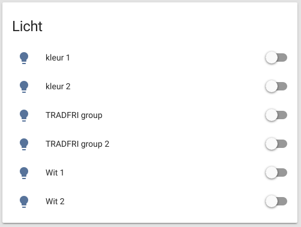
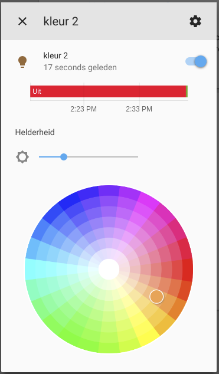
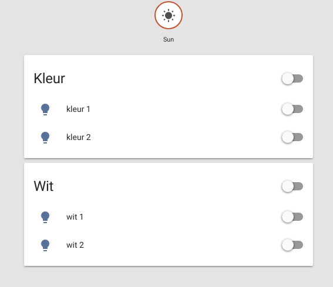

# Tradfri gateway toevoegen aan HA

1. open `configuration.yml` en voeg het volgende toe (192.168.0.199 is het ip-adres van de Tradfri gateway in de dojo setup) en sla het bestand op.

``` yaml
tradfri:
  host: 192.168.0.199
```

2. Herstart HomeAssistant
3. open HomeAssitant in jouw browser (http://<ip-adres-van-jouw-ha>:8123).
4. Klik op de 'Configureer' link naast het _Tradfri_ component en voor de volgende security key in: `PguXe57gmynUHRgu`
5. In HomeAssitant zou je nu het volgende moeten zien:




Er zijn 4 lampen, _kleur 1, kleur 2, wit 1_ en _wit 2_ en 2 groepen _Kleur_ en _Wit_
Met de 'schakelaars' naast aan de rechterkant kun je de lampen aan en uit zetten. En als je op het lamp icon klikt, dan kan je de kleur en helderheid instellen.



Alle lampen zo op een rijtje is een beetje onoverzichtelijk, dus gaan we ze per groep in een aparte kaart zetten (zie https://www.home-assistant.io/components/group/ voor meer info)

1. open `groups.yml` en voeg het volgende toe en sla dit op.

``` yaml
default_view:
  view: yes
  icon: mdi:home
  entities:
    - sun.sun
    - group.kleur
    - group.wit

kleur:
  name: Kleur
  entities:
    - light.kleur1
    - light.kleur_2
wit:
  name: Wit
  entities:
    - light.wit_1
    - light.wit_2
```

2. Ga in HomeAssistant naar _`Instellingen -> Algemeen`_ en klik op _`HERLAAD GROEPEN`_ in het _`Configuratie herladen`_ blok

Als je nu terug gaat naar het _`Overzicht`_ scherm, dan ziet het er ongeveer zo uit:


